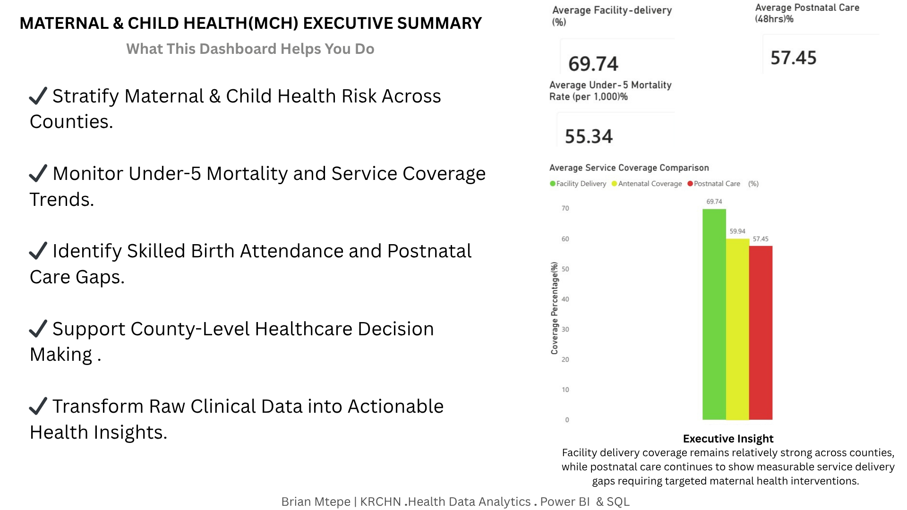
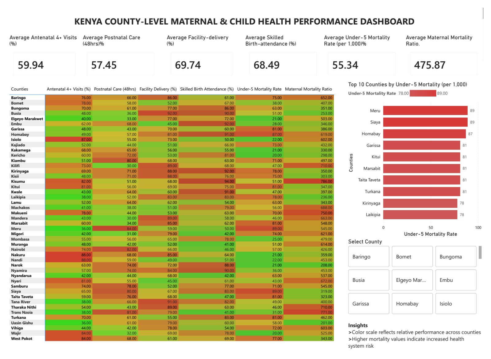
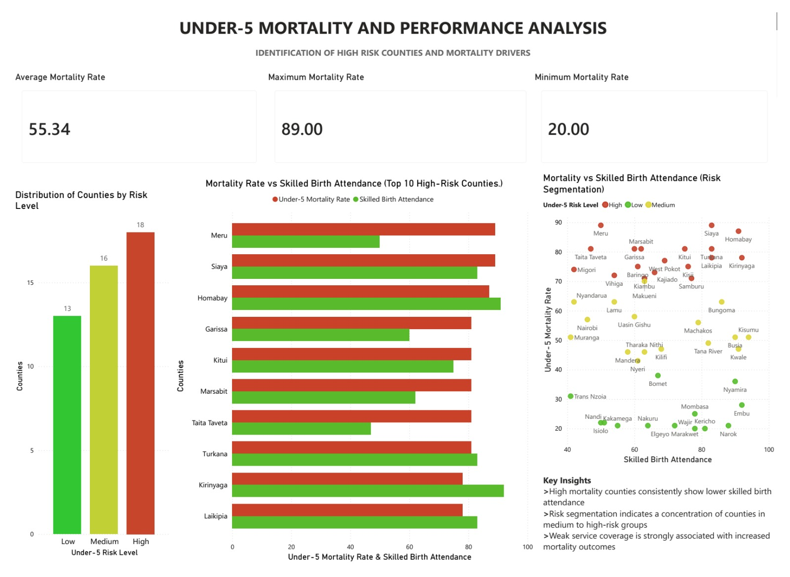
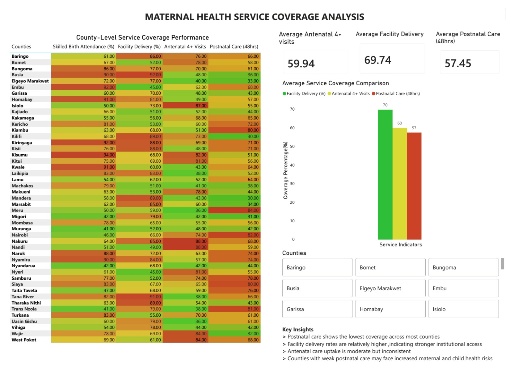

# Maternal & Child Health (MCH) County Analytics Dashboard

## Clinical Triage of Service Gaps Across Kenya's 47 Counties

This project is a healthcare analytics solution designed to monitor Maternal & Child Health (MCH) indicators across Kenya using **Power BI, SQL, and Python**.

The dashboard transforms raw clinical datasets into executive-level insights for hospitals, NGOs, and public health decision-makers.

---

# Executive Summary
*The primary clinical findings and system overview.*

---

# National MCH Triage Dashboard
*National heatmap analysis for mortality and service coverage.*

---

# Risk Segmentation Analysis
*County-level stratification of mortality vs. facility delivery.*

---

# Postnatal Care Gap Diagnostic
*Clinical drill-down into the 48-hour service leak.*

---

# Project Objectives
* **Monitor** Maternal & Child Health service coverage across all regions.
* **Identify** high-risk counties with poor clinical outcomes.
* **Compare** Facility Delivery, Antenatal Coverage, and Postnatal Care indicators.
* **Support** county-level healthcare decision-making with evidence-based data.
* **Transform** raw clinical datasets into actionable health informatics insights.

---

# Key Clinical Insights
* **Facility Delivery Coverage**: Average Facility Delivery Rate is **69.74%**.
* **Antenatal Care Coverage**: Average ANC 4+ Coverage stands at **59.94%**.
* **Postnatal Care Gap**: Average Postnatal Care within 48 Hours is **57.45%**.
* **Under-5 Mortality Risk**: Average Under-5 Mortality Rate is **55.34 per 1,000**.

---

# Technical Stack
| Category | Tools Used |
| :--- | :--- |
| **Data Cleaning** | Python (Pandas, NumPy) |
| **Database** | SQL |
| **Visualization** | Power BI |
| **Executive Reporting** | Canva |
| **Version Control** | GitHub |

---

# Author
## **Brian Mtepe**
**KRCHN Registered Nurse | Health Data Analyst**
