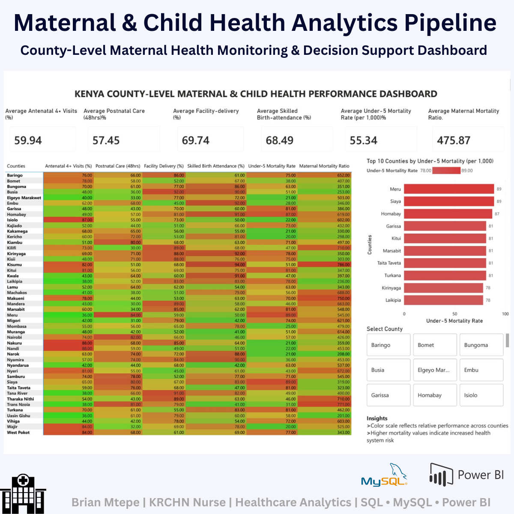
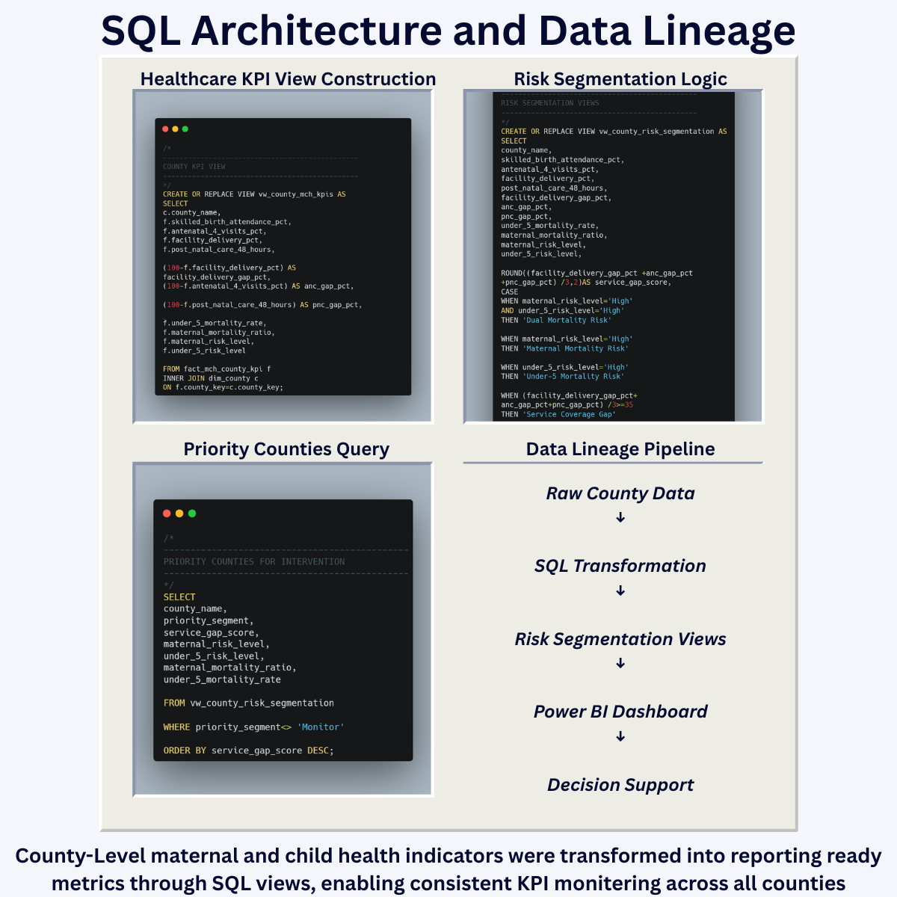
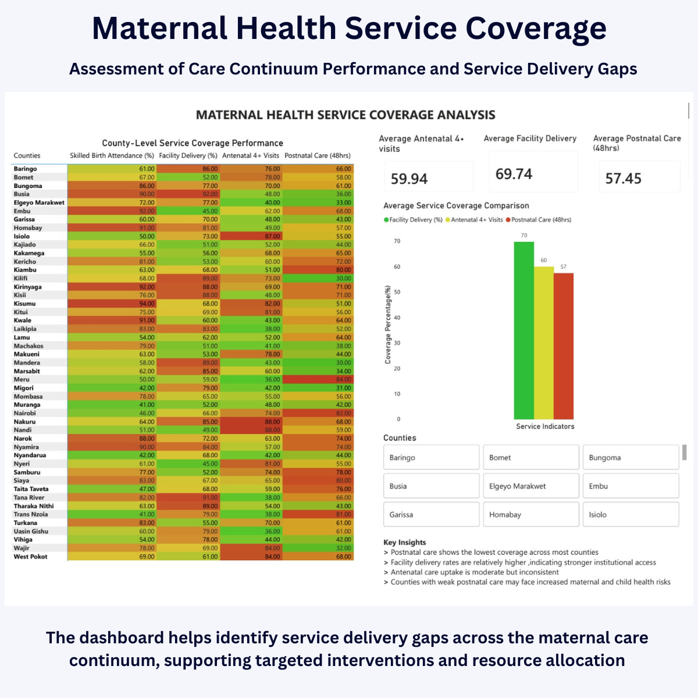
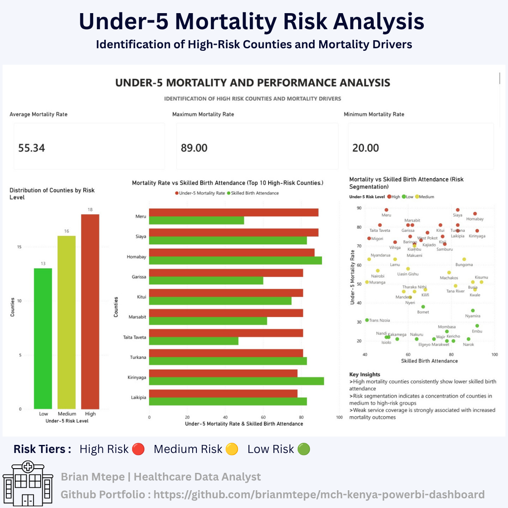

# Maternal & Child Health (MCH) County Analytics Pipeline

## Clinical Triage of Service Gaps Across Kenya's 47 Counties

This project is a healthcare analytics solution designed to monitor Maternal & Child Health (MCH) indicators across Kenya using Power BI, SQL, MySQL, and Python.

The solution transforms county-level healthcare data into reporting-ready insights that support public health monitoring, risk identification, resource allocation, and evidence-based decision-making.

---

# Executive Summary & Analytics Pipeline

End-to-end healthcare analytics workflow supporting Maternal & Child Health performance monitoring and decision support.

This project transforms county-level Maternal & Child Health (MCH) data into a structured healthcare analytics workflow designed to support monitoring, risk identification, and evidence-based decision-making.

The solution combines SQL data modeling, healthcare KPI views, risk segmentation logic, and Power BI dashboards to deliver reporting-ready insights for public health stakeholders.

---

# Problem Statement

Maternal and child health outcomes are often affected by delayed identification of service delivery gaps and regional healthcare disparities. Public health teams require clear, data-driven tools to monitor mortality trends, evaluate maternal healthcare coverage, and prioritize high-risk counties for intervention.

Traditional spreadsheet reporting makes it difficult to rapidly identify:

- Counties with elevated under-5 mortality rates
- Gaps between facility delivery and postnatal care utilization
- Regional inequalities in healthcare service coverage
- Counties requiring targeted public health interventions

This project addresses these challenges through interactive healthcare analytics and executive-level dashboard reporting.

---

# Solution Overview

An end-to-end healthcare analytics pipeline was developed to:

- Monitor Maternal & Child Health indicators at county level
- Visualize mortality and healthcare service trends
- Stratify counties by healthcare risk level
- Support evidence-based public health decision-making
- Transform structured healthcare data into actionable clinical insights

The workflow included:

- SQL-based data modeling and transformation
- Python (Pandas) data cleaning and preprocessing
- Healthcare KPI and risk segmentation view development
- Power BI dashboard development and reporting
- Executive healthcare reporting using Canva

---

# Analytics Pipeline Architecture

The project follows a structured healthcare analytics workflow:
↓
Raw County Health Data

↓
SQL Data Modeling

↓
Healthcare KPI Views

↓
Risk Segmentation Logic

↓
Power BI Dashboards

Healthcare Decision Support

This architecture improves consistency, simplifies reporting, and supports rapid identification of priority intervention areas.

---

# Analytics Pipeline Showcase

# SQL Architecture & Data Lineage

Healthcare KPI view creation, risk segmentation logic, and reporting-ready SQL transformation workflow.

---

# Executive Decision Support Framework

Translation of county-level healthcare indicators into actionable public health insights.

---

# Under-5 Mortality Risk Analysis

Identification of high-risk counties and mortality drivers through comparative healthcare performance analysis.

---

# Project Objectives

- Monitor Maternal & Child Health service coverage across counties
- Identify high-risk counties with poor healthcare outcomes
- Compare Facility Delivery, ANC, and Postnatal Care indicators
- Support county-level healthcare planning and reporting
- Transform raw clinical datasets into actionable public health insights

---

# Key Clinical Insights

Indicator| Finding
Facility Delivery Coverage| Average Facility Delivery Rate: 69.74%
ANC 4+ Coverage| Average ANC Coverage: 59.94%
Postnatal Care Coverage| Average PNC within 48 Hours: 57.45%
Under-5 Mortality| Average Rate: 55.34 per 1,000

# Key Findings

- Counties with higher Skilled Birth Attendance generally demonstrate lower Under-5 Mortality rates.
- Postnatal Care remains a critical gap within the maternal care continuum.
- Significant county-level variation exists in healthcare service coverage and outcomes.
- Risk segmentation supports targeted resource allocation and performance monitoring.
- County benchmarking enables rapid identification of priority intervention areas.

---

# Dashboard Features

- End-to-end healthcare analytics pipeline
- SQL data modeling and healthcare KPI views
- County-level healthcare risk analysis
- Executive healthcare reporting and decision support
- Risk segmentation and intervention prioritization
- Interactive Power BI dashboards and filtering capabilities

---

# Technical Workflow

## Data Preparation & Transformation
- Data validation and preprocessing using Python (Pandas)
- Healthcare indicator standardization
- SQL transformation and KPI development
- Risk segmentation logic creation

## Dashboard Development

- Power BI data modeling
- KPI and performance monitoring development
- County-level healthcare risk visualization
- Interactive filtering and drill-down analysis

## Executive Reporting

- Canva executive showcase development
- GitHub project documentation
- Portfolio-ready healthcare analytics reporting

---

# Technical Stack

Category| Tools Used
Data Cleaning| Python (Pandas, NumPy)
Database| SQL, MySQL
Visualization| Power BI
Executive Reporting| Canva
Version Control| GitHub

---

# Intended Users

- Public Health Officers
- County Health Management Teams
- NGOs and Development Programs
- Healthcare Analysts
- Health Informatics Professionals
- Recruiters and Portfolio Reviewers

---

# Limitations

- Synthetic demonstration dataset
- Simplified county-level modeling
- Not intended for direct clinical deployment

---

# Project Status

Completed as an end-to-end healthcare analytics portfolio project demonstrating:
- Clinical KPI reporting
- Public health analytics
- Maternal health monitoring
- SQL data modeling and reporting views
- Healthcare decision-support analytics
- Executive dashboard visualization

---

# Author

## *Brian Mtepe*
*KRCHN Registered Nurse | Health Data Analyst*

### Specializations
- Healthcare Analytics
- Power BI Dashboards
- SQL Reporting
- Clinical KPI Monitoring
- Public Health Informatics
